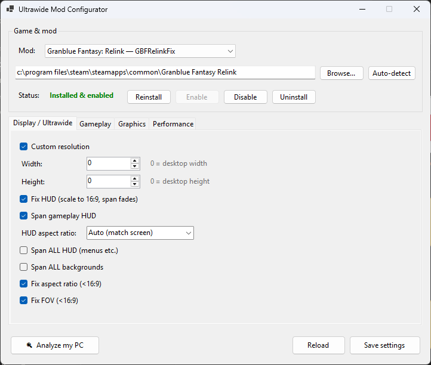

# UWPDVMod — Ultrawide Mod Configurator

A standalone Windows desktop app for configuring and installing ultrawide / ASI game mods
through a friendly UI instead of hand-editing config files. The entire interface is generated
from data-only **mod profiles**, so supporting a new game means adding one profile — the engine
and UI never change.




## Features

- **Friendly settings editor** — every mod option as a labelled control with a hover tooltip.
  Your config file's comments and formatting are preserved byte-for-byte on save.
- **Analyze my PC** — detects your display (resolution and refresh rate, including a panel that
  supports a higher rate than the current desktop), GPU and VRAM, then proposes the best settings.
  It shows every proposed change with a reason and applies nothing until you confirm.
- **One-click install management** — Install, Reinstall, Disable, Enable, and Uninstall the mod
  in any game folder. The game is auto-detected from your Steam libraries, or you can browse to it.
  - *Disable* deactivates the mod without losing your settings (renames the ASI loader).
  - *Uninstall* backs your settings up to `%APPDATA%\UWPDVMod\backup` before removing files.
- **Single self-contained executable** — `UWPDVMod.exe` runs on any 64-bit Windows PC with no
  .NET install required. The mod files are embedded, so it's a genuine one-file download.
- **Elevation only when needed** — runs unprivileged; if Windows blocks a write to a game folder
  under `Program Files`, it offers a one-time "retry as administrator".

## Download & run

Grab `UWPDVMod.exe`, double-click it, and:

1. Confirm the detected game folder (or click **Browse…**).
2. If the mod isn't installed yet, click **Install**.
3. Adjust settings across the **Display**, **Gameplay**, **Graphics**, and **Performance** tabs —
   or click **Analyze my PC** to have it pick good defaults — then **Save settings**.

Settings apply the next time you launch the game.

## Settings overview (Granblue profile)

| Tab | What's there |
|-----|--------------|
| **Display / Ultrawide** | Custom resolution (0 = your desktop), Fix HUD, Span HUD + aspect-ratio preset, Fix aspect ratio / FOV for narrow displays |
| **Gameplay** | Field-of-view and camera-distance multipliers |
| **Graphics** | Shadow-quality override, level-of-detail multiplier, disable TAA |
| **Performance** | Framerate-cap raise (30–240 fps) and injection delay |

## Building from source

Requires the .NET 10 SDK.

```powershell
# dev build / run (framework-dependent)
dotnet build UWPDVMod.slnx
dotnet run --project src/UWPDVMod.App

# refresh the embedded Granblue payload (needs the GBFRelinkFix mod built in the sibling repo)
powershell -File scripts/fetch-granblue-payload.ps1

# produce the single self-contained exe -> publish/UWPDVMod.exe
powershell -File publish.ps1
```

## How it works

Two projects:

```
src/UWPDVMod.Core   engine + profiles, no WinForms UI:
                      IniDocument        comment/format-preserving ini editor
                      GameLocator        Steam library detection
                      ModInstaller       install / enable / disable / uninstall state machine
                      SystemAnalyzer     display + GPU + VRAM detection
                      IModProfile        a game's data: paths, install layout, settings schema,
                                         and hardware-recommendation rules
                      GranblueRelinkProfile   the one built-in profile

src/UWPDVMod.App    WinForms exe:
                      MainForm             builds every tab and control from the active profile's schema
                      SettingControlFactory   maps a schema entry to the right control + read/write
```

The UI knows nothing about any specific game; it renders whatever the selected profile's schema
describes.

### Adding a game

1. Implement `IModProfile` in `UWPDVMod.Core` — its `GameSpec` (exe / Steam folder),
   `InstallLayout` (loader and file paths), settings `Schema` (groups → settings → controls with
   tooltips and presets), and a `Recommend(HardwareInfo)` method.
2. Register it in `ProfileRegistry`.
3. Drop its payload files under `payload/<profile-id>/` so `fetch`/`publish` embed them.

No UI code changes required.

## Credits

Ships today with a single profile: **Granblue Fantasy: Relink** (the
[GBFRelinkFix](https://codeberg.org/Lyall/GBFRelinkFix) mod).

The Granblue profile drives the **GBFRelinkFix** mod by Lyall and contributors. This tool only
edits that mod's settings and manages its files; it does not modify the game itself.


## Note
This repository and mod is not usually mantained, is intended mostly for personal use.